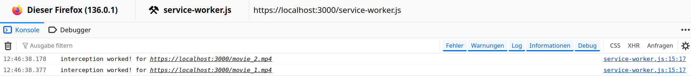

This example demonstrates an issue with js service workers and tinymce iframe in Chrome.
In Firefox it is possible to intercept fetch calls with a service worker for elements (video for example) in tinymce, but not in Chrome.

The service worker can be found here:
[service-worker.js](service-worker.js)

Tinymce and the service worker are registered/inited here:
[index.html](index.html)

movie_2 is a video element outside tinymce iframe and movie_1 is a  video element inside the tinymce iframe.

The movie_2.mp4 can be intercepted from firefox and chrome via service worker but not the movie_1.mp4 which is in the tinymce iframe (only in Chrome).

as seen in the logs:

1. chrome log - index.html can be provided as http or https

only movie_2 was intercepted by the service worker

2. firefox logs - index.html needs to provided via https (additional info: logs for service workers can be found here in firefox: about:debugging#/runtime/this-firefox and incognito does not work with service workers!)

both are intercepted as expected movie_2 and movie_1

it does work with an simple iframe on another index2.html page with the video element for example. So there must be an tinymce iframe issue.
